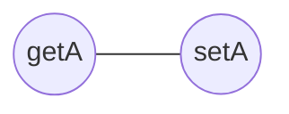

# TCC *vs* LCC

Explain under which circumstances *Tight Class Cohesion* (TCC) and *Loose Class Cohesion* (LCC) metrics produce the same value for a given Java class. Build an example of such as class and include the code below or find one example in an open-source project from Github and include the link to the class below. Could LCC be lower than TCC for any given class? Explain.

## Answer

## Exercice 1

If all methods in a class are directly connected, LCC and TCC are equal to 1, as it has the perfect cohesion.

Example of one of this class :
```java
class Foo {
	private int a;
	
	public int getA() {
		return a;
	}
	
	public void setA(int a) {
		this.a = a;
	}
	
}
```



Here there is 1 pair of method and all pairs are directly connected. So TCC and LCC are equal to 1.

TCC can at most be equal to LCC because LCC represent all possibly connected pairs of methods and TCC represent all directly connected methods. So TCC is included in LCC so it can not be lower.